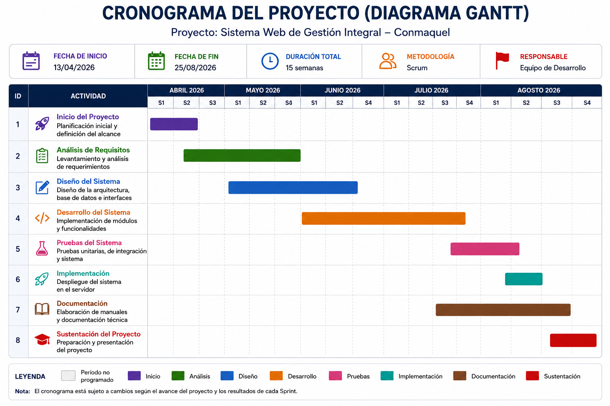

# 7. Sprint Planning

## 7.1 Objetivo del Sprint 0

Definir la estructura técnica, el entorno de trabajo y el diseño de la base de datos antes de iniciar el desarrollo funcional.

## 7.2 Tareas del Sprint 0

| ID | Rol | Descripción general | Tareas detalladas | Esfuerzo (h) |
|---|---|---|---|---|
| HU01 | Equipo técnico | Definir estructura y modelo de datos | Diseñar modelo entidad-relación; definir tablas y relaciones; generar script SQL | 20 |
| HU02 | Equipo técnico | Configurar entorno de desarrollo | Seleccionar tecnologías; configurar servidor local; crear estructura de archivos | 14 |
| HU03 | Administrador | Validar requisitos finales | Revisar procesos con Conmaquel; ajustar detalles de campos y formatos | 8 |
| HU04 | Equipo técnico | Establecer conexiones y seguridad básica | Configurar conexión a base de datos; definir niveles de acceso iniciales | 12 |
| | | **Total** | | **54** |

## 7.3 Reuniones Scrum diarias (Sprint 0)

| Día | Trabajo realizado el día anterior | Trabajo a realizar hoy | Impedimentos / Observaciones |
|---|---|---|---|
| 1 | Reunión inicial con el cliente para definir el alcance | Establecer los módulos principales y datos necesarios para el sistema | Ninguno |
| 2 | Se definieron los módulos y flujos generales | Iniciar el diseño del modelo entidad-relación para usuarios y productos | Ninguno |
| 3 | Diseño de tablas básicas: usuario, producto, reserva | Agregar tablas de ventas, servicios y movimientos de inventario | Ninguno |
| 4 | Relaciones entre tablas y restricciones de integridad | Revisar y corregir errores en el modelo | Ninguno |
| 5 | Modelo final aprobado por el equipo | Generar el código SQL para crear la base de datos en MySQL | Ninguno |
| 6 | Script generado y probado en phpMyAdmin | Insertar datos de prueba para verificar funcionamiento | Ninguno |
| 7 | Pruebas de consultas y relaciones entre tablas | Definir tecnologías de desarrollo: PHP, HTML, CSS, JavaScript | Ninguno |
| 8 | Configuración de herramientas de trabajo | Diseñar la estructura general de navegación del sitio web | Ninguno |
| 9 | Estructura de navegación y entorno listos | Validar todo el trabajo con el cliente para iniciar el Sprint 1 | Ninguno |

## 7.4 Cronograma de hitos y entregables por fase

El proyecto se organiza en un Sprint 0 de preparación y cuatro sprints de desarrollo, sumando **54 días hábiles**. Cada fase cierra con un hito de control y un entregable verificable por el cliente.

| Fase | Duración | Hito de cierre | Entregable |
|---|---|---|---|
| **Sprint 0** — Preparación | 9 días (semana 1–2) | Aprobación del modelo de datos y del entorno de trabajo | Modelo entidad-relación, script SQL inicial y entorno de desarrollo configurado |
| **Sprint 1** — Sitio web y reservas | 12 días (semana 2–4) | Sitio web público y módulo de reservas validados por el cliente | Sitio web funcional con catálogo y sistema de reservas de citas |
| **Sprint 2** — Ventas y servicios | 15 días (semana 4–7) | Módulo de ventas y servicios técnicos aceptado | Módulo de registro de ventas y seguimiento de servicios técnicos |
| **Sprint 3** — Gestión de inventario | 10 días (semana 7–9) | Módulo de inventario FIFO validado | Módulo de inventario con alertas de vencimiento y control de stock |
| **Sprint 4** — Informes, seguridad e implementación | 8 días (semana 9–11) | Sistema desplegado en ambiente de producción | Sistema integrado con reportes, control de accesos por rol y despliegue final |

# Figura

## Figura 9.Cronograma tipo Gantt del proyecto

*Figura 9. Cronograma tipo Gantt del proyecto (Sprint 0 a Sprint 4, 54 días hábiles distribuidos en 11 semanas).*

## 7.5 Sprint Planning de los sprints 1 a 4

Cada Sprint Planning posterior al Sprint 0 sigue la misma dinámica: el Product Owner (representante de Conmaquel) presenta las prioridades del Product Backlog (ver **06-product-backlog.md**), el equipo técnico estima el esfuerzo de cada tarea y se define el Sprint Backlog correspondiente. El seguimiento diario se realiza mediante reuniones breves (Daily Scrum) y el cierre de cada sprint incluye un Sprint Review (demostración al cliente) y una Sprint Retrospective (mejora del proceso).
