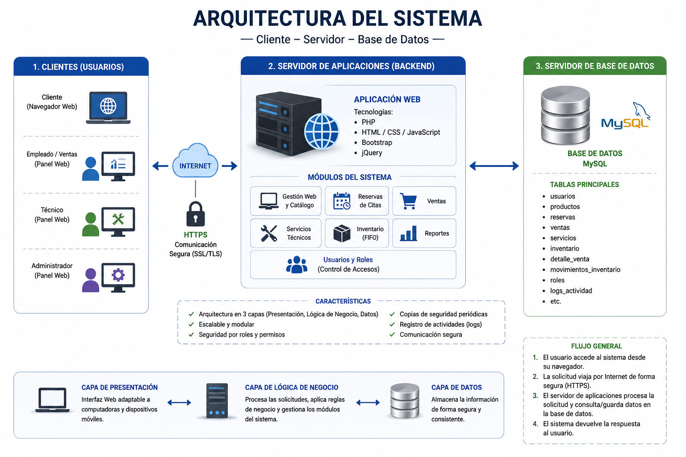

# Arquitectura del Sistema

## Descripción

La arquitectura del Sistema Web de Gestión Integral para Conmaquel fue diseñada siguiendo el modelo Cliente – Servidor – Base de Datos, permitiendo una comunicación eficiente entre los usuarios, el servidor de aplicaciones y la base de datos.

Esta arquitectura facilita el mantenimiento, la seguridad, la escalabilidad y la disponibilidad del sistema, garantizando una correcta gestión de la información y un adecuado rendimiento para todos los procesos del negocio.

---

# Objetivos de la Arquitectura

- Organizar el sistema en componentes independientes.
- Facilitar el mantenimiento del software.
- Mejorar la seguridad de la información.
- Permitir el crecimiento del sistema.
- Optimizar el rendimiento de las consultas.

---

# Arquitectura General

El sistema está compuesto por tres capas principales:

## 1. Cliente

Corresponde a los usuarios que interactúan con el sistema mediante un navegador web.

Funciones principales:

- Inicio de sesión.
- Consulta de productos.
- Registro de reservas.
- Gestión de ventas.
- Visualización de reportes.

---

## 2. Servidor de Aplicaciones

Recibe las solicitudes provenientes del cliente y ejecuta la lógica de negocio.

Funciones:

- Validación de usuarios.
- Gestión de productos.
- Procesamiento de reservas.
- Registro de ventas.
- Generación de reportes.
- Comunicación con la base de datos.

---

## 3. Base de Datos

Almacena toda la información del sistema.

Entre las principales tablas se encuentran:

- Usuarios
- Roles
- Productos
- Categorías
- Inventario
- Reservas
- Ventas
- Detalle de Ventas

---

# Flujo de Funcionamiento

El funcionamiento del sistema sigue el siguiente proceso:

1. El usuario accede desde un navegador web.
2. El cliente envía una solicitud al servidor.
3. El servidor procesa la solicitud.
4. Se consulta o actualiza la base de datos.
5. El servidor genera una respuesta.
6. El cliente visualiza el resultado.

---

# Tecnologías Utilizadas

| Capa | Tecnología |
|-------|------------|
| Cliente | HTML5, CSS3, JavaScript, Bootstrap |
| Servidor | PHP |
| Base de Datos | MySQL |
| Control de Versiones | Git y GitHub |

---

# Ventajas de la Arquitectura

- Separación de responsabilidades.
- Mayor seguridad.
- Fácil mantenimiento.
- Escalabilidad.
- Reutilización del código.
- Mejor rendimiento.

---

# Diagrama de Arquitectura

A continuación se presenta la arquitectura general del sistema.

**Figura 7. Arquitectura del Sistema Cliente
