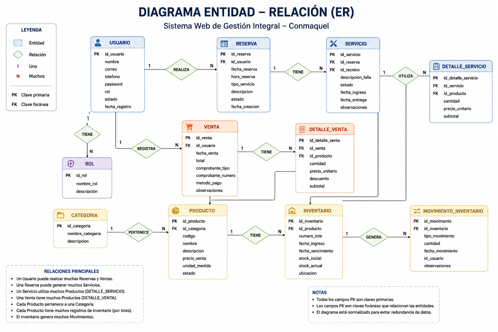

# 10. Modelo Entidad-Relación

## 10.1 Tecnología

- **Motor de base de datos**: MySQL.
- **Herramienta de gestión**: phpMyAdmin.

## 10.2 Gestión de inventarios (regla de negocio central)

Se implementa el método **FIFO (Primero en Entrar, Primero en Salir)**, ideal para productos electrónicos y componentes que pueden perder vigencia o caducar (baterías, por ejemplo).

Funcionalidades asociadas:

- Registro de fecha de ingreso, lote y fecha de vencimiento.
- Alertas automáticas cuando quedan 30 días para el vencimiento.
- Descuento automático de stock al registrar una venta, priorizando el lote más antiguo.
- Historial completo de movimientos con identificación de quién realizó la operación (kardex).

## 10.3 Entidades principales (versión base del informe)

1. **Usuario**: ID_Usuario (PK), Nombre, Correo, Teléfono, Rol, Contraseña, Estado.
2. **Producto**: ID_Producto (PK), Código, Nombre, Categoría, Precio, Stock, Fecha_Vencimiento, Proveedor.
3. **Reserva**: ID_Reserva (PK), ID_Usuario (FK), Fecha, Hora, Tipo_Servicio, Estado.
4. **Venta**: ID_Venta (PK), Fecha, Total, ID_Usuario_Registra, Comprobante.
5. **Servicio**: ID_Servicio (PK), ID_Reserva, ID_Técnico, Descripción, Estado, Materiales.

## 10.4 Modelo entidad-relación ampliado (según pantallas implementadas)

Para soportar todos los módulos del sistema (Usuarios, Productos, Categorías, Inventario por lotes, Reservas, Ventas, Clientes, Reportes y Configuración con Roles/Permisos), el modelo base se amplía con las siguientes entidades:

| Entidad | Atributos principales |
|---|---|
| **rol** | id_rol (PK), nombre, descripcion, estado |
| **permiso** | id_permiso (PK), id_rol (FK), modulo, ver, crear, editar, eliminar |
| **usuario** | id_usuario (PK), nombres, apellidos, dni, correo, telefono, usuario, contrasena_hash, id_rol (FK), foto, estado, ultimo_acceso |
| **categoria** | id_categoria (PK), nombre, descripcion, icono, estado |
| **producto** | id_producto (PK), sku, nombre, descripcion, id_categoria (FK), tipo, precio, stock_minimo, imagen, estado |
| **lote_inventario** | id_lote (PK), id_producto (FK), numero_lote, fecha_ingreso, fecha_vencimiento, costo_unitario, cantidad_actual, id_proveedor (FK) |
| **movimiento_inventario** | id_movimiento (PK), id_lote (FK), tipo (entrada/salida), cantidad, documento_referencia, id_usuario (FK), fecha |
| **proveedor** | id_proveedor (PK), razon_social, ruc, telefono, correo |
| **cliente** | id_cliente (PK), tipo_cliente (natural/empresa), nombres_razon_social, tipo_documento, num_documento, correo, telefono, direccion, canal_origen, estado |
| **reserva** | id_reserva (PK), id_cliente (FK), id_servicio_tipo (FK), fecha, hora, estado, id_usuario_aprueba (FK) |
| **venta** | id_venta (PK), id_cliente (FK), id_usuario (FK), fecha, subtotal, igv, total, metodo_pago, estado |
| **detalle_venta** | id_detalle (PK), id_venta (FK), id_producto (FK), id_lote (FK), cantidad, precio_unitario |
| **servicio_tecnico** | id_servicio (PK), id_reserva (FK), id_tecnico (FK), descripcion, materiales_usados, estado |

## 10.5 Relaciones principales

- Un **rol** puede tener muchos **usuarios**, pero cada usuario pertenece a un solo rol.
- Un **rol** tiene muchos **permisos** (uno por módulo del sistema).
- Un **usuario** puede tener muchas **reservas** registradas o aprobadas, pero cada reserva pertenece a un solo cliente y, opcionalmente, a un usuario que la aprueba.
- Un **producto** puede estar en muchas **ventas** (a través de `detalle_venta`), pero cada línea de detalle corresponde a un solo producto y a un solo lote (para mantener la trazabilidad FIFO).
- Un **producto** puede tener muchos **lotes de inventario**; cada lote pertenece a un solo producto y, opcionalmente, a un proveedor.
- Un **lote** tiene muchos **movimientos de inventario** (entradas y salidas).
- Un **técnico** (usuario con rol Técnico) puede atender varios **servicios técnicos**, pero cada servicio tiene un solo responsable asignado.
- Una **categoría** puede tener muchos **productos**, pero cada producto pertenece a una sola categoría.

# Figura

## Figura 6. Diagrama Entidad-Relación

*Figura 6. Diagrama Entidad-Relación completo del sistema Conmaquel.*

## 10.6 Correspondencia con las pantallas del sistema

| Entidad | Pantallas relacionadas |
|---|---|
| usuario / rol / permiso | `usuarios-lista.html`, `usuarios-registrar.html`, `usuarios-detalle.html`, `configuracion.html` (pestañas Roles y Permisos) |
| categoria | `categorias-lista.html` |
| producto | `productos-lista.html`, `productos-registrar.html` |
| lote_inventario / movimiento_inventario | `inventario-stock.html`, `inventario-entradas.html`, `inventario-salidas.html`, `inventario-kardex.html` |
| cliente | `clientes-lista.html`, `clientes-registrar.html`, `clientes-perfil.html` |
| reserva / servicio_tecnico | `reservas-lista.html` |
| venta / detalle_venta | `ventas-pos.html` |
