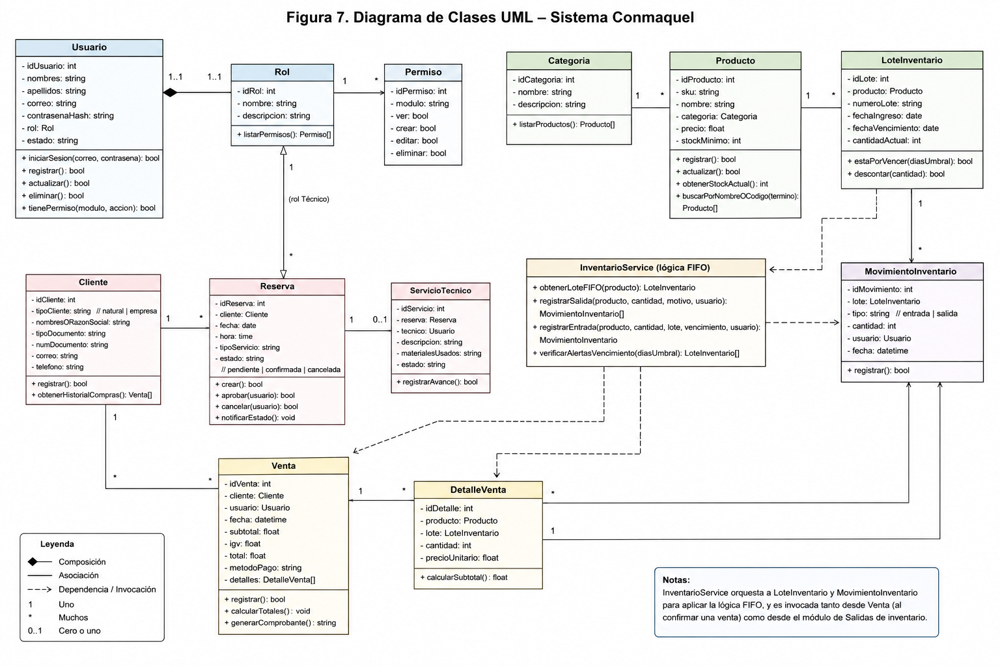

# 11. Diagrama de Clases (UML)


*Figura 7. Diagrama de Clases UML del sistema Conmaquel.*

## 11.1 Clases principales y su estructura

### Clase `Usuario`
```
- idUsuario: int
- nombres: string
- apellidos: string
- correo: string
- contrasenaHash: string
- rol: Rol
- estado: string
+ iniciarSesion(correo, contrasena): bool
+ registrar(): bool
+ actualizar(): bool
+ eliminar(): bool
+ tienePermiso(modulo, accion): bool
```

### Clase `Rol`
```
- idRol: int
- nombre: string
- descripcion: string
+ listarPermisos(): Permiso[]
```

### Clase `Permiso`
```
- idPermiso: int
- modulo: string
- ver: bool
- crear: bool
- editar: bool
- eliminar: bool
```

### Clase `Producto`
```
- idProducto: int
- sku: string
- nombre: string
- categoria: Categoria
- precio: float
- stockMinimo: int
+ registrar(): bool
+ actualizar(): bool
+ obtenerStockActual(): int
+ buscarPorNombreOCodigo(termino): Producto[]
```

### Clase `Categoria`
```
- idCategoria: int
- nombre: string
- descripcion: string
+ listarProductos(): Producto[]
```

### Clase `LoteInventario`
```
- idLote: int
- producto: Producto
- numeroLote: string
- fechaIngreso: date
- fechaVencimiento: date
- cantidadActual: int
+ estaPorVencer(diasUmbral): bool
+ descontar(cantidad): bool
```

### Clase `MovimientoInventario`
```
- idMovimiento: int
- lote: LoteInventario
- tipo: string   // entrada | salida
- cantidad: int
- usuario: Usuario
- fecha: datetime
+ registrar(): bool
```

### Clase `InventarioService` (lógica FIFO)
```
+ obtenerLoteFIFO(producto): LoteInventario
+ registrarSalida(producto, cantidad, motivo, usuario): MovimientoInventario[]
+ registrarEntrada(producto, cantidad, lote, vencimiento, usuario): MovimientoInventario
+ verificarAlertasVencimiento(diasUmbral): LoteInventario[]
```

### Clase `Cliente`
```
- idCliente: int
- tipoCliente: string   // natural | empresa
- nombresORazonSocial: string
- tipoDocumento: string
- numDocumento: string
- correo: string
- telefono: string
+ registrar(): bool
+ obtenerHistorialCompras(): Venta[]
```

### Clase `Reserva`
```
- idReserva: int
- cliente: Cliente
- fecha: date
- hora: time
- tipoServicio: string
- estado: string   // pendiente | confirmada | cancelada
+ crear(): bool
+ aprobar(usuario): bool
+ cancelar(usuario): bool
+ notificarEstado(): void
```

### Clase `ServicioTecnico`
```
- idServicio: int
- reserva: Reserva
- tecnico: Usuario
- descripcion: string
- materialesUsados: string
- estado: string
+ registrarAvance(): bool
```

### Clase `Venta`
```
- idVenta: int
- cliente: Cliente
- usuario: Usuario
- fecha: datetime
- subtotal: float
- igv: float
- total: float
- metodoPago: string
- detalles: DetalleVenta[]
+ registrar(): bool
+ calcularTotales(): void
+ generarComprobante(): string
```

### Clase `DetalleVenta`
```
- idDetalle: int
- producto: Producto
- lote: LoteInventario
- cantidad: int
- precioUnitario: float
+ calcularSubtotal(): float
```

## 11.2 Relaciones entre clases

- `Usuario` **1..1 — 1..1** `Rol` (composición: un usuario pertenece exactamente a un rol).
- `Rol` **1 — N** `Permiso` (un rol agrupa varios permisos, uno por módulo).
- `Categoria` **1 — N** `Producto`.
- `Producto` **1 — N** `LoteInventario`.
- `LoteInventario` **1 — N** `MovimientoInventario`.
- `Cliente` **1 — N** `Reserva` y **1 — N** `Venta`.
- `Venta` **1 — N** `DetalleVenta`; `DetalleVenta` **N — 1** `Producto` y **N — 1** `LoteInventario`.
- `Reserva` **1 — 0..1** `ServicioTecnico` (una reserva de tipo servicio técnico genera una orden de servicio).
- `Usuario` (rol Técnico) **1 — N** `ServicioTecnico`.
- `InventarioService` orquesta a `LoteInventario` y `MovimientoInventario` para aplicar la lógica FIFO descrita en **10-modelo-er.md**, y es invocada tanto desde `Venta` (al confirmar una venta) como desde el módulo de Salidas de inventario.
