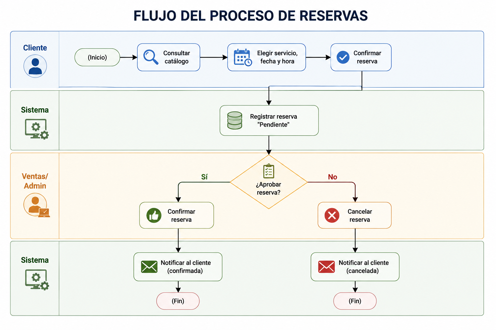

# 13. Diagramas BPMN

## 13.1 Notación utilizada

Los procesos de negocio de Conmaquel se modelan siguiendo la notación estándar **BPMN 2.0**:

- ⬭ **Evento de inicio / fin**: círculo simple (inicio) y círculo de borde grueso (fin).
- ▭ **Tarea**: rectángulo de esquinas redondeadas.
- ◆ **Compuerta (gateway)**: rombo, para decisiones exclusivas (XOR).
- **Carril (lane/pool)**: agrupa las tareas por actor responsable.

## 13.2 Proceso: Reserva de cita (RF-06, RF-07, RF-08, RF-09)

```
[Cliente]        (Inicio) → Consultar catálogo → Elegir servicio, fecha y hora → Confirmar reserva
                                                                                        │
[Sistema]                                                          Registrar reserva "Pendiente"
                                                                                        │
[Ventas/Admin]                                              ◇ ¿Aprobar reserva? 
                                                          Sí ↙            ↘ No
                                            Confirmar reserva              Cancelar reserva
                                                    │                            │
[Sistema]                              Notificar al cliente (confirmada)   Notificar al cliente (cancelada)
                                                    │                            │
                                                  (Fin)                        (Fin)
```


*Figura 3 (detalle BPMN). Flujo del proceso de reservas.*

## 13.3 Proceso: Venta de productos (RF-03, RF-04, RF-11)

```
[Ventas]   (Inicio) → Buscar y agregar productos al ticket → Seleccionar cliente
                                                                      │
                                                        Elegir método de pago
                                                                      │
[Sistema]                                    ◇ ¿Stock disponible en algún lote?
                                          Sí ↙                              ↘ No
                            Descontar stock (FIFO)              Mostrar alerta de stock
                            y registrar movimiento                 insuficiente
                                          │                              │
                            Generar comprobante de venta          Volver a editar ticket
                                          │
                                        (Fin)
```

## 13.4 Proceso: Entrada de inventario (RF-04, RNF-09)

```
[Bodega]   (Inicio) → Seleccionar producto → Registrar cantidad, costo, lote y vencimiento
                                                                    │
[Sistema]                                          Actualizar stock del producto
                                                                    │
                                          Registrar movimiento de entrada en el kardex
                                                                    │
                                                                  (Fin)
```

## 13.5 Proceso: Servicio técnico (HU05, RF-11)

```
[Cliente]     (Inicio) → Reservar cita de servicio técnico
                                    │
[Sistema]              Crear orden de servicio vinculada a la reserva
                                    │
[Técnico]              Atender la cita → Registrar avance y materiales usados
                                    │
                        ◇ ¿Servicio finalizado?
                    No ↙                    ↘ Sí
        Continuar registrando avances    Marcar servicio como completado
                                                    │
                                                  (Fin)
```

## 13.6 Relación con los módulos del sistema

| Proceso BPMN | Módulo(s) del sistema |
|---|---|
| Reserva de cita | Reservas (lista, nueva, detalle, aprobar, cancelar) |
| Venta de productos | Ventas (POS), Inventario (kardex) |
| Entrada de inventario | Inventario (entradas, stock, kardex) |
| Servicio técnico | Reservas + módulo de servicio técnico (detalle de orden) |
